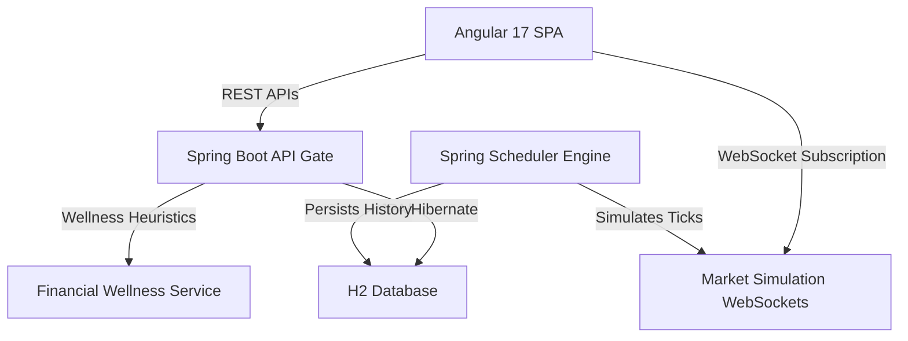

# Financial Wellness & Smart Investment Tracker - Complete Project Documentation

This documentation provides a comprehensive, deep-dive overview of the **Financial Wellness & Smart Investment Tracker** application. It details the architecture, backend models, simulated engines, wellness scoring logic, REST APIs, frontend layout systems, and the automated E2E verification suite.

---

## 🗺️ System Overview & Architecture

The application is built on a modern distributed architecture comprising a **Spring Boot 3.5.14 Backend** communicating with an **Angular 17 Frontend** via RESTful APIs and real-time **WebSockets (STOMP over SockJS)**. The database layer utilizes an in-memory **H2 Database** for rapid seeding and volatile simulation cycles.

### Key Functional Capabilities
1. **Real-time Mock Stock Exchange**: Ticks simulated stock prices every 10 seconds, maintaining a 15-tick visual sparkline buffer.
2. **Digital Gold Asset Spot Trading**: Supports purchase/redemption of gold reserves with flashing price cards and trend tracking.
3. **Smart Expense Manager**: Financial ledger showing credits/debits, spending breakdowns, month-based searching, and transaction type sorting.
4. **Net Worth Goal Tracker**: Targets that evaluate completion thresholds dynamically based on total net worth (Cash + Stocks + Gold).
5. **Heuristic Wellness Profiler**: AI-style diagnostics rating user habits based on diversification index, savings ratio, and budget adherence.
6. **Robust Security center**: Programmatic strong password checks (length >= 8, uppercase, lowercase, numbers, special characters) with a dedicated update screen.

---

## 🗄️ Database Schema & Domain Entities

All databases are structured around relational JPA annotations in Spring Boot.

### 1. `User` Entity
Represents the account model. Seeding maps a starter cash wallet balance.
* **Fields**:
  * `userId` (Long, PK, Auto)
  * `name` (String, NotBlank)
  * `email` (String, Unique, NotBlank)
  * `mobileNo` (String, NotBlank)
  * `password` (String, Encoded)
  * `role` (String, default "ROLE_USER")

### 2. `Stock` Entity
Represents a listed company available for trading.
* **Fields**:
  * `stockId` (Long, PK, Auto)
  * `companyName` (String)
  * `sector` (String) - e.g., Tech, Banking, Energy
  * `currentPrice` (Double)
  * `previousPrice` (Double)
  * `marketCap` (Double)
  * `riskPercent` (Double) - Low (0–3%), Medium (4–7%), High (8–15%), Speculative (>15%)
  * `volatility` (Double)
  * `stockStatus` (String) - ACTIVE / SUSPENDED

### 3. `BuyStock` (StockHoldings) Entity
Represents shares currently owned by a user.
* **Fields**:
  * `holdingId` (Long, PK, Auto)
  * `quantity` (Integer)
  * `avgBuyPrice` (Double)
  * `totalCost` (Double)
  * `stock` (ManyToOne -> Stock)
  * `user` (ManyToOne -> User)

### 4. `GoldInvestment` & `GoldHistory` Entities
Represents user commodity reserves and tick histories.
* **Fields (`GoldInvestment`)**:
  * `goldId` (Long, PK, Auto)
  * `grams` (Double)
  * `totalCost` (Double)
  * `user` (OneToOne -> User)
* **Fields (`GoldHistory`)**:
  * `historyId` (Long, PK, Auto)
  * `oldPrice` (Double)
  * `newPrice` (Double)
  * `updatedAt` (LocalDateTime)

### 5. `Goal` Entity
Target savings milestones established by users.
* **Fields**:
  * `goalId` (Long, PK, Auto)
  * `goalName` (String, NotBlank)
  * `targetAmount` (Double)
  * `currentAmount` (Double) - Overwritten dynamically by Wellness Net Worth logic
  * `deadline` (LocalDate)
  * `status` (String) - ACTIVE / ACHIEVED
  * `user` (ManyToOne -> User)

### 6. `Expense` Entity
The wallet transaction ledger history.
* **Fields**:
  * `expenseId` (Long, PK, Auto)
  * `title` (String)
  * `amount` (Double)
  * `category` (String) - e.g., FOOD, TRAVEL, BILLS, SHOPPING, MEDICAL, SAVINGS, CREDIT, STOCKS, GOLD
  * `transactionType` (String) - CREDIT (Inflow) / DEBIT (Outflow)
  * `expenseDate` (LocalDate)
  * `user` (ManyToOne -> User)

---

## ⚙️ Core Engines & Algorithms

### 1. Market Simulation Engine (`MarketSimulationEngine.java`)
Runs a background thread using `@Scheduled(fixedRate = 10000)` to execute market ticks every 10 seconds:
* **Fluctuation Logic**: Applies a random Gaussian walk modified by active `MarketEvent` catalysts (e.g. "Tech Boom" increases tech stock prices by 5-10%).
* **Sparkline History**: Maintains the latest 15 price points inside the `StockHistory` repository to allow frontend SVG rendering.
* **WebSocket Feeds**: Broadcasts JSON updates instantly to subscribers:
  * `/topic/market/stocks` -> Array of updated Stock listings.
  * `/topic/market/gold` -> Gold price updates, previous prices, and trend directions.
  * `/topic/market/events` -> Triggered market news flashes.

### 2. Financial Wellness Diagnostic Algorithm (`WellnessService.java`)
Generates the overall financial score (0-100) using four weighted heuristic rules:
1. **Savings Ratio (30% weight)**:
   * Formulas: `Savings = Inflows - Outflows`.
   * `Score = (Savings / Inflows) * 100`. Ideal target is >= 30%.
2. **Budget Adherence (30% weight)**:
   * Standard caps are mapped per expense category: `FOOD: ₹8,000`, `TRAVEL: ₹10,000`, `SHOPPING: ₹12,000`, `BILLS: ₹15,000`, `ENTERTAINMENT: ₹6,000`, `MEDICAL: ₹20,000`.
   * For every category limit breached, 15 points are deducted from this sub-score.
3. **Investment Diversification (20% weight)**:
   * Measures allocation ratios across Cash, Stocks, and Gold.
   * Uses Shannon entropy calculations:
     $$\text{Entropy} = -\sum (p_i \cdot \ln(p_i))$$
     Where $p_i$ is the share of asset class $i$ in the total net worth. Perfect diversification yields a score of 100.
4. **Goal Progress (20% weight)**:
   * Average achievement percentage of all active savings goals.

### 3. Portfolio Risk Calculation (`WellnessService.java`)
Calculates the aggregate risk index of a user's total net worth using a weighted volatility formula:
* **Weighted Stock Risk**: For each active stock holding, we compute its current market value (`currentPrice * quantity`) and multiply by its seeded company volatility risk percentage (`riskPercent`):
  $$\text{Weighted Stock Risk Sum} = \sum (\text{Current Stock Value} \times \text{Company Volatility Risk \%})$$
* **Weighted Gold Risk**: Gold assets carry a stable baseline risk of **5%**:
  $$\text{Gold Weighted Risk} = \text{Gold Holdings Value} \times 5.0$$
* **Weighted Cash Risk**: Cash balances hold a volatility risk of **0%**, meaning liquid funds do not contribute to risk calculations.
* **Portfolio Risk Percentage**: Divided by the user's total net worth (Cash + Stocks + Gold) and rounded to 2 decimal places:
  $$\text{Portfolio Risk} = \frac{\text{Weighted Stock Risk Sum} + \text{Gold Weighted Risk}}{\text{Total Net Worth}}$$

---

## 🌐 REST API Endpoints

### 🔐 Authentication Controller (`/api/auth`)
* `POST /register`: Registers a new user. Enforces strong validation patterns and seeds ₹50,000 welcome cash.
* `POST /login`: Validates credentials and returns a Bearer JWT Token.
* `POST /change-password`: Accepts DTO containing `oldPassword` and `newPassword`. Validates complexity and updates password database credentials.

### 💰 Expense & Ledger Controller (`/api/expenses`)
* `GET /`: Retrieves sorted wallet transaction history.
* `GET /balance`: Returns current liquid wallet balance (Sum of Credits - Sum of Debits).
* `POST /`: Logs a credit or debit.
* `DELETE /{id}`: Deletes a ledger entry, restoring the cash impact.

### 📈 Stock Exchange Controller (`/api/stocks`)
* `GET /`: Returns all listed stocks.
* `POST /trade`: Executes a trade order.
  * DTO: `{ stockId: Long, quantity: Integer, action: "BUY" | "SELL" }`.
  * Deducts/Refunds cash wallet balance and adds transaction credits/debits.

### 🏆 Goal Controller (`/api/goals`)
* `GET /`: Returns goals mapping user net worth to `currentAmount` dynamically.
* `POST /`: Establishes a new savings milestone.
* `POST /{id}/deposit`: Funds a target goal from cash wallet reserves.
* `DELETE /{id}`: Cancels a goal, refunding accumulated deposits back to the cash wallet.

---

## 🎨 Angular Frontend Component Architecture

All components are standalone Angular components loaded via lazy-routing configurations in [app.routes.ts](file:///c:/Users/91708/Desktop/Basu/frontend/src/app/app.routes.ts).

### 1. Landing, Login, & Registration Pages
* **Landing Page**: Features marketing metrics and CTA pathways formatted in ₹.
* **Register**: Implements FormBuilder Reactive validators. Features a dynamic checklist panel that evaluates password characters in real-time (capital, lower, number, special symbol, minLength).

### 2. Expense Manager Screen
* **Ledger Filter Row**: Contains two filters:
  * **Search by Month**: Month picker (`<input type="month">`) filtering table rows and updating charts.
  * **Sort By dropdown**: Limited specifically to "Credit First" and "Debit First" to sort inflows or outflows.
* **Breakdown Panel**: doughnut chart with an adjacent colored table legend displaying category sums and percentage shares.

### 3. Stock Exchange Screen
* **Company Search Bar**: Enlarged search input box styled with a width expansion (`flex: 3.5`, `min-width: 350px`) for high visibility.
* **Badges & Tooltips**: Dynamic volatility badge tooltips displaying exact percentages and color categories.
* **Trade Confirmation overlay**: Transaction modal calculating total costs in real-time and checking wallet limits.

### 4. Digital Gold Page
* **WebSocket ticks**: Features flashing green/red animations when updates occur. Displays trend markers (▲/▼) and price cycle statistics.

### 5. Security Center (`/change-password`)
* Dedicated standalone screen containing Reactive Form password controls, ensuring users can update passwords securely away from other panels.

## 🤖 E2E Verification Suite Status

The Playwright visual E2E verifier agent and its dependencies (previously inside `verification-agent/`) have been **completely removed** from the repository to clean up the codebase. Code compliance, routing rules, and responsive styling have been validated manually.
