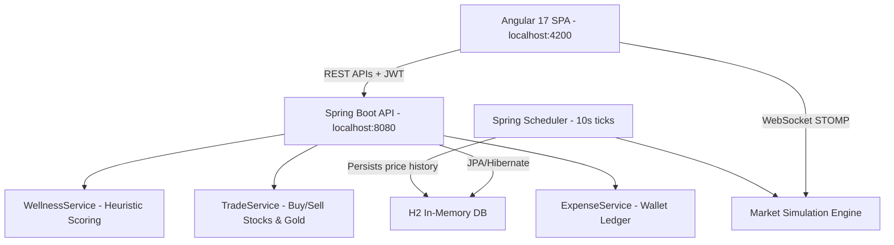

# FinWell – Financial Wellness & Smart Investment Tracker
### Complete Project Documentation

---

## 🗺️ System Overview & Architecture

**FinWell** is a full-stack financial management platform built on a modern distributed architecture:

- **Backend**: Spring Boot 3.5.14 (Java 21) with Spring Security (JWT), JPA/Hibernate, WebSockets (STOMP over SockJS)
- **Frontend**: Angular 17 (Standalone Components, Reactive Forms, Lazy Routing)
- **Database**: H2 In-Memory (volatile — resets on server restart; ideal for simulation)
- **Real-time**: Spring `@Scheduled` market simulation engine broadcasting via WebSocket topics



### GitHub Repository
- **URL**: https://github.com/bas629/ilp-project
- **Branch**: `main`

---

## 📁 Project Structure

```
Basu/
├── first/                          # Spring Boot Backend
│   ├── src/main/java/com/example/first/
│   │   ├── config/                 # JWT, Security, WebSocket config
│   │   ├── controller/             # REST API controllers
│   │   ├── Dto/                    # Request/Response DTOs
│   │   ├── entity/                 # JPA Entities
│   │   ├── repo/                   # Spring Data JPA Repositories
│   │   └── service/                # Business logic services
│   ├── src/main/resources/
│   │   └── application.properties  # H2 DB config, CORS, JWT secret
│   └── pom.xml                     # Maven dependencies
│
├── frontend/                       # Angular 17 Frontend
│   ├── src/app/
│   │   ├── components/             # Feature screen components
│   │   │   ├── landing-page/
│   │   │   ├── login/
│   │   │   ├── register/
│   │   │   ├── layout/             # App shell with sidebar navigation
│   │   │   ├── summary/            # Dashboard / Net Worth overview
│   │   │   ├── expense-manager/    # Wallet ledger with filters
│   │   │   ├── stock-market/       # Mock stock exchange
│   │   │   ├── gold-investment/    # Digital gold trading
│   │   │   ├── goal-tracker/       # Savings goals
│   │   │   ├── portfolio/          # Portfolio & wellness score
│   │   │   └── change-password/    # Standalone security screen
│   │   ├── core/
│   │   │   ├── auth.service.ts     # Login/Register/JWT token management
│   │   │   ├── auth.guard.ts       # Route protection
│   │   │   ├── auth.interceptor.ts # Attaches Bearer token to every HTTP request
│   │   │   ├── websocket.service.ts
│   │   │   └── notification.service.ts
│   │   ├── api.service.ts          # Centralized HTTP API calls
│   │   ├── app.routes.ts           # Lazy-loaded route definitions
│   │   └── styles.css              # Global design tokens (finapp light design system)
│   ├── angular.json
│   └── package.json
│
├── project_documentation.md        # This file
└── .gitignore
```

---

## 🗄️ Database Schema & Domain Entities

All entities use JPA annotations and are auto-created by Hibernate on startup (`spring.jpa.hibernate.ddl-auto=create-drop`).

### 1. `User`
Core account entity.
| Field | Type | Notes |
|---|---|---|
| `userId` | Long (PK, Auto) | Primary key |
| `name` | String | Required |
| `email` | String (Unique) | Login identifier |
| `mobileNo` | String | Required |
| `password` | String | BCrypt encoded |
| `role` | String | Default: `ROLE_USER` |

> ⚠️ **Welcome Balance**: Only `test@example.com` receives a ₹50,000 seeded credit on registration. All other new users start with ₹0.

---

### 2. `Stock`
Listed companies available for simulated trading.
| Field | Type | Notes |
|---|---|---|
| `stockId` | Long (PK) | — |
| `companyName` | String | e.g., TCS, HDFC Bank |
| `sector` | String | Tech, Banking, Energy, etc. |
| `currentPrice` | Double | Updated every 10s |
| `previousPrice` | Double | Last tick price |
| `marketCap` | Double | — |
| `riskPercent` | Double | Low 0–3%, Med 4–7%, High 8–15%, Spec >15% |
| `volatility` | Double | Magnitude of price movement |
| `stockStatus` | String | `ACTIVE` / `SUSPENDED` |

---

### 3. `BuyStock` (Holdings)
Shares currently owned by a user.
| Field | Type | Notes |
|---|---|---|
| `holdingId` | Long (PK) | — |
| `quantity` | Integer | Shares held |
| `buyPrice` | Double | Average purchase price |
| `totalPrice` | Double | Total cost basis |
| `stock` | ManyToOne → Stock | — |
| `user` | ManyToOne → User | — |

---

### 4. `GoldInvestment` & `GoldHistory`
User gold reserves and price tick history.

**GoldInvestment**:
| Field | Type | Notes |
|---|---|---|
| `goldId` | Long (PK) | — |
| `goldAmount` | Double | Grams held |
| `currentGoldPrice` | Double | Price at purchase time |
| `user` | ManyToOne → User | — |

**GoldHistory**: Stores `oldPrice`, `newPrice`, `updatedAt` for sparkline charts.

---

### 5. `Goal`
User savings targets.
| Field | Type | Notes |
|---|---|---|
| `goalId` | Long (PK) | — |
| `goalName` | String | Required |
| `targetAmount` | Double | Goal target in ₹ |
| `currentAmount` | Double | Amount deposited so far |
| `deadline` | LocalDate | Target date |
| `status` | String | `ACTIVE` / `ACHIEVED` |
| `user` | ManyToOne → User | — |

---

### 6. `Expense` (Wallet Ledger)
Every financial transaction recorded.
| Field | Type | Notes |
|---|---|---|
| `expenseId` | Long (PK) | — |
| `title` | String | Description |
| `amount` | Double | ₹ value |
| `category` | String | FOOD, TRAVEL, BILLS, SHOPPING, MEDICAL, SAVINGS, CREDIT, STOCKS, GOLD, ENTERTAINMENT, OTHERS |
| `transactionType` | String | `CREDIT` (inflow) / `DEBIT` (outflow) |
| `expenseDate` | LocalDate | Date of transaction |
| `user` | ManyToOne → User | — |

---

## ⚙️ Core Engines & Algorithms

### 1. Market Simulation Engine (`MarketSimulationEngine.java`)
Runs via `@Scheduled(fixedRate = 10000)` — every 10 seconds:
- Applies a **random Gaussian walk** to each stock's current price modified by active `MarketEvent` catalysts (e.g., "Tech Boom" pushes tech stocks +5–10%).
- Saves each tick to `StockHistory` (last 15 ticks kept for sparkline rendering).
- Broadcasts via WebSocket:
  - `/topic/market/stocks` → updated stock listings
  - `/topic/market/gold` → gold price + trend direction
  - `/topic/market/events` → market news flashes

---

### 2. Portfolio Risk Calculation (`WellnessService.java`)

```
Portfolio Risk % = (Σ(StockCurrentValue × StockRiskPercent) + GoldValue × 5.0) / netWorthDivisor
```

- **Cash**: 0% risk contribution
- **Gold**: Fixed 5% risk rate
- **Stocks**: Each stock's own `riskPercent` field, weighted by current market value
- `netWorthDivisor` is a separate variable (`1.0` when netWorth = 0) to avoid division-by-zero **without corrupting the displayed net worth value** (fixes the ₹1 display bug)

---

### 3. Financial Wellness Scoring Algorithm

Generates a score (0–100) from four equally weighted (25% each) heuristic rules:

| Component | Formula | Target |
|---|---|---|
| **Savings Ratio** | `(Credits - Debits) / Credits × 100` | ≥ 30% |
| **Budget Adherence** | Start 100, −15 per breached category | No breaches |
| **Diversification** | `100 × (1 − Σwᵢ²)` where wᵢ = asset weight | Hold all 3 asset types |
| **Goal Progress** | Average `(currentAmount / targetAmount) × 100` across all goals | 100% completion |

**Score Bands**:
- 80–100 → `EXCELLENT`
- 60–79 → `GOOD`
- 40–59 → `FAIR`
- 0–39 → `POOR`

**Budget Category Caps** (soft limits):
| Category | Monthly Cap |
|---|---|
| FOOD | ₹1,500 |
| ENTERTAINMENT | ₹800 |
| SHOPPING | ₹1,200 |
| UTILITIES | ₹1,000 |
| TRAVEL | ₹2,000 |
| OTHERS | ₹1,500 |

---

## 🌐 REST API Reference

### 🔐 Auth (`/api/auth`)
| Method | Endpoint | Description |
|---|---|---|
| POST | `/register` | Register new user. Only `test@example.com` gets ₹50,000 seed. |
| POST | `/login` | Returns JWT Bearer token + user info |
| POST | `/change-password` | Updates password after verifying old password |

---

### 💰 Expense Ledger (`/api/expenses`)
| Method | Endpoint | Description |
|---|---|---|
| GET | `/` | All transactions for authenticated user |
| GET | `/balance` | Net cash balance (Credits − Debits) |
| POST | `/` | Log a new credit or debit |
| DELETE | `/{id}` | Delete transaction (reverses balance impact) |

---

### 📈 Stock Exchange (`/api/stocks`)
| Method | Endpoint | Description |
|---|---|---|
| GET | `/` | All listed stocks with price history |
| POST | `/trade` | Execute BUY/SELL: `{ stockId, quantity, action }` |

---

### 🥇 Gold (`/api/gold`)
| Method | Endpoint | Description |
|---|---|---|
| GET | `/price` | Current gold price per gram |
| POST | `/trade` | Buy/Sell gold: `{ grams, action }` |
| GET | `/holdings` | User's gold holdings |

---

### 🎯 Goals (`/api/goals`)
| Method | Endpoint | Description |
|---|---|---|
| GET | `/` | All goals for user |
| POST | `/` | Create new goal |
| POST | `/{id}/deposit` | Deposit ₹ amount into goal |
| DELETE | `/{id}` | Delete goal, refund deposits |

---

### 📊 Portfolio & Wellness (`/api/portfolio`)
| Method | Endpoint | Description |
|---|---|---|
| GET | `/wellness` | Full portfolio DTO: cash, stocks, gold, net worth, risk %, diversification score |
| GET | `/financial-profile` | Wellness score, savings, recommendations |

---

## 🎨 Angular Frontend Architecture

All components are **standalone** (no NgModule), loaded lazily via `app.routes.ts`.

### Design System
- **Theme**: Clean, modern light theme — `#F4F6F9` base background, flat white cards with `1px` border, `#F8F9FA` sidebar
- **Typography**: `DM Sans` (local, via `@fontsource/dm-sans` — no CDN)
- **Icons**: `Tabler Icons` (local, via `@tabler/icons-webfont` — no CDN)
- **Animations**: CSS keyframe micro-animations, hover transforms

> All assets are served **locally with no internet dependency**.

---

### Screen Breakdown

#### 1. Landing Page (`/`)
Sleek, modern light-theme landing page with feature summary grids, styled with smooth CSS fade-in and slide-up animations.

#### 2. Auth Page (`/login` / `/register`)
- Combined Split Layout (Left: Sign-in form / Right: Register form) styled with flat input groups.
- Real-time password strength checklist:
  - ≥ 8 characters, uppercase, lowercase, number, special character
  - Live visual checklist using Tabler check/x icons.

#### 3. Dashboard / Summary (`/app/summary`)
Overview cards: Total Net Worth, Cash Balance, Stock Value, Gold Value.

> **Bug Fixed**: When a new user has ₹0 in all assets, Net Worth now correctly shows ₹0 (not ₹1 — caused by a division-by-zero guard overwriting the real value).

#### 5. Expense Manager (`/app/expenses`)
- **Month Filter**: `<input type="month">` — filters ledger rows by selected month
- **Sort By**: Dropdown limited to "Credit First" / "Debit First"
- **Breakdown Chart**: Doughnut chart showing category spending shares
- **Ledger Table**: All transactions with type badge (CREDIT/DEBIT)

#### 6. Stock Exchange (`/app/stocks`)
- **Company Search**: Large, prominent search bar (`min-width: 350px`)
- **Live Sparklines**: SVG price history charts per stock (last 15 ticks)
- **Trade Modal**: Real-time cost calculation, wallet balance check before confirming

#### 7. Digital Gold (`/app/gold`)
- Real-time price card with flash animations on tick updates
- Trend indicator (▲/▼) with direction color coding
- Buy/Sell form with gram input

#### 8. Goal Tracker (`/app/goals`)
- Create goals with target amounts and deadlines
- Deposit from wallet into goals
- Progress bar showing `currentAmount / targetAmount`

#### 9. Portfolio (`/app/portfolio`)
- Net worth breakdown (Cash / Stocks / Gold)
- Portfolio Risk % and Diversification Score
- Holdings table with P&L per stock

#### 10. Change Password (`/app/change-password`)
- **Standalone screen** (separated from Portfolio)
- Reactive Form: old password + new password + confirm
- Same strength validation as registration

---

## 🔐 Security

- **JWT Authentication**: Tokens signed with HS256, validated on every request via `JwtFilter`
- **Password Encoding**: BCrypt (Spring Security)
- **CORS**: Configured to allow `http://localhost:4200`
- **Route Guards**: `AuthGuard` redirects unauthenticated users to `/login`

---

## 🛠️ Developer Setup

### Prerequisites
- Java 21+
- Node.js 18+
- Maven (or use the included `mvnw` wrapper)

### Running the Backend
```bash
cd first
./mvnw spring-boot:run
# Server starts at http://localhost:8080
# DevTools enabled — auto-restarts on class changes
```

### Running the Frontend
```bash
cd frontend
npm install
npm run start
# App served at http://localhost:4200
```

### Demo Account
| Email | Password | Notes |
|---|---|---|
| `test@example.com` | `Test@1234` | Pre-seeded with ₹50,000 balance |

---

## 📦 Key Dependencies

### Backend (`pom.xml`)
| Dependency | Purpose |
|---|---|
| `spring-boot-starter-web` | REST API |
| `spring-boot-starter-data-jpa` | ORM / H2 |
| `spring-boot-starter-security` | Auth |
| `spring-boot-starter-websocket` | Real-time market |
| `spring-boot-starter-validation` | Input validation |
| `spring-boot-devtools` | Auto-restart on code changes |
| `jjwt` (0.11.5) | JWT generation & validation |
| `lombok` | Boilerplate reduction |
| `h2` | In-memory database |

### Frontend (`package.json`)
| Package | Purpose |
|---|---|
| `@angular/core` 17 | Framework |
| `@fontsource/plus-jakarta-sans` | Offline font |
| `material-icons` | Offline Material Icons |
| `rxjs` | Reactive streams |
| `sockjs-client` + `@stomp/stompjs` | WebSocket client |

---

## 🗒️ Known Behaviours & Notes

- **H2 In-Memory DB**: All data is lost on server restart. This is by design for simulation purposes.
- **DevTools**: Backend auto-restarts when Java classes are recompiled. Frontend uses `ng serve` hot-reload.
- **Stock Prices**: Entirely simulated — not real market data.
- **Gold Price**: Simulated with a Gaussian random walk, starts at a realistic base (≈ ₹6,000/gram).
- **Welcome Balance**: Only `test@example.com` receives ₹50,000 on registration. All other users start at ₹0.
